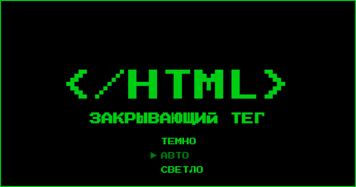
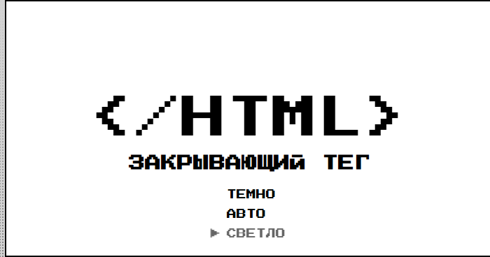
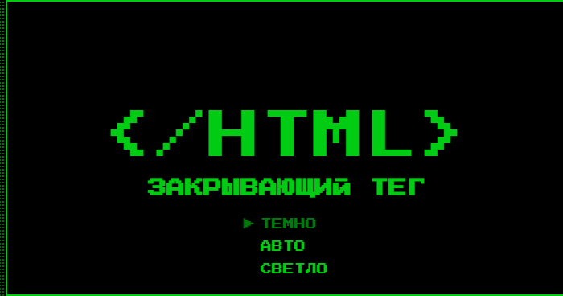
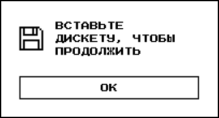
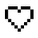

<h1 align="center">«Закрывающий тег»</h1>

  
*Главная страница сайта с карточками-воспоминаниями*

**«Закрывающий тег»** — это финальный проект модуля вёрстки, посвящённый рефлексии пройденного пути. Здесь собраны личные заметки, фотографии и эмоции, связанные с каждым этапом обучения. Сайт реализует переключение светлой и тёмной темы, анимированное сердечко для отметки понравившихся моментов и стильное модальное окно.

[](https://github.com/CLoudXVII/zakrivayuschiy-teg-f/actions/workflows/tests.yml)

## 🚀 Демо

Проект опубликован на GitHub Pages: [ссылка на опубликованный сайт](https://cloudxvii.github.io/zakrivayuschiy-teg-f/)  
*Если ссылка не открывается, добавьте в конце `/index.html`.*

## 🛠 Технологии

<div align="center">
  
  
  
  
  
  
</div>

- **HTML5** — семантическая разметка, использование `<dialog>` для модального окна, мнемоники для спецсимволов (`&lt;` и `&gt;`).
- **CSS3** — кастомные свойства (CSS-переменные), градиентный фон, анимации, фильтры (`sepia`, `saturate`, `blur` и др.), режимы смешивания (`mix-blend-mode`), псевдоэлементы, медиазапросы.
- **JavaScript** — переключение тем (светлая/тёмная/авто) с сохранением в `localStorage`, обработка кликов по сердечку (лайк) с анимацией.
- **SVG** — иконки: дискета (использована как `<symbol>`), анимированное сердце (инлайново с классами для анимации).
- **Адаптивность** — Mobile First подход, резиновая вёрстка с `clamp()`, медиазапрос для экранов ≤375px.
- **Шрифты** — вариативный шрифт Inter (поддержка диапазона весов) и моноширинный PressStart2P.

## ✨ Функциональность

- 🌗 **Переключение тем** — три режима: «Светло», «Темно», «Авто» (следит за системными настройками). Выбор сохраняется в `localStorage`.
- ❤️ **Анимированное сердечко** — при клике на иконку запускается сложная анимация: перекрашивание частей, масштабирование и вспышка искр. Повторный клик возвращает в исходное состояние.
- 🖼 **Карточки-воспоминания** — 8 карточек, каждая с уникальным заголовком, личным текстом, изображением и лейблом, описывающим эмоцию.
- 🎨 **Фильтры на изображениях** — каждая картинка обработана CSS-фильтрами (сепия, насыщенность, контраст, размытие и др.), некоторые комбинированы.
- 📦 **Модальное окно** — при нажатии «Сохранить на память» открывается `<dialog>` с иконкой дискеты и текстом, закрывается по кнопке «Ок».
- 🖱 **Интерактивные кнопки** — при наведении появляется заливка, текст меняет цвет за счёт `mix-blend-mode: difference`, при фокусе — тень или рамка.

## 📸 Скриншоты

| Светлая тема | Тёмная тема |
|--------------|-------------|
|  |  |

| Модальное окно | Анимация сердца |
|----------------|-----------------|
|  |  |

## 🔍 Особенности реализации

- **Переменные для тем** — все цвета, толщины шрифтов и фоновые градиенты вынесены в CSS-переменные. В `variables.css` заданы значения для светлой темы по умолчанию, в `themes.css` переопределяются для тёмной и авто-режима с учётом `prefers-color-scheme`.
- **Сложный градиентный фон** — состоит из трёх слоёв: повторяющиеся полосы по горизонтали и вертикали, и линейный градиент от светлого к тёмному. Фон зафиксирован (`background-attachment: fixed`).
- **Анимация сердечка** — реализована через ключевые кадры (`scale` для группы `.heart`, появление искр) и переходы (`transition`) для смены цвета частей (`core`, `main-body`, `contour`). Управляется классами `is-liked` и псевдоклассами `:hover`, `:active`.
- **Кнопки с эффектом заливки** — при наведении псевдоэлемент `::after` масштабируется от 0 до 1 по оси X. Текст и иконка внутри имеют `mix-blend-mode: difference`, что создаёт эффект смены цвета при наезде тёмного фона.
- **Фильтры на изображениях** — для каждой карточки задан уникальный класс (`.image_sepia`, `.image_blur` и т.д.) с соответствующим фильтром. Одно изображение использует множественный фильтр (`blur` + `grayscale` + `invert`).
- **Лейблы на карточках** — позиционированы абсолютно, используют `mix-blend-mode: hard-light` и текст с обводкой (через `text-shadow` или `-webkit-text-stroke` с проверкой `@supports`).
- **Модальное окно** — реализовано на теге `<dialog>`, стилизован задний фон (`::backdrop`). Кнопка открытия использует атрибут `onclick` с вызовом `showModal()`, закрытие — через кнопку с `close()`.
- **Резиновая вёрстка** — ширина контейнеров задана через `clamp()` или проценты, что позволяет плавно адаптироваться к разным разрешениям. Для мобильных устройств (≤375px) переопределены отступы и расположение элементов.

## 🧱 Структура проекта

```
zakrivayuschiy-teg-f/
├── .github/               # GitHub Actions для автоматического тестирования
├── fonts/                  # Шрифты Inter-Variable, PressStart2P
├── images/                 # Изображения для карточек (котики в разных форматах: avif, webp, jpg)
├── scripts/
│   ├── like.js             # Скрипт обработки кликов по сердечку
│   └── set-theme.js        # Скрипт переключения тем (с сохранением в localStorage)
├── styles/
│   ├── animations.css      # Анимации для сердечка и кнопок
│   ├── globals.css         # Глобальные сбросы и база
│   ├── style.css           # Основные стили (Mobile First)
│   ├── themes.css          # Переменные для тёмной темы и prefers-color-scheme
│   ├── variables.css       # CSS-переменные по умолчанию (светлая тема)
│   └── ...                 # Остальные файлы
├── svg/
│   ├── floppy.svg          # SVG-спрайт с дискетой
│   └── icon.svg            # Иконка для фавикона
├── index.html              # Главная страница
└── README.md               # Этот файл
```

## 🚦 Запуск проекта локально

```bash
# Клонируйте репозиторий
git clone https://github.com/CLoudXVII/zakrivayuschiy-teg-f.git

# Перейдите в папку проекта
cd zakrivayuschiy-teg-f

# Откройте index.html в любом современном браузере
# Можно использовать Live Server в VS Code для автоматического обновления
```

## 🎯 Цель проекта

Проект создавался как финальная работа модуля вёрстки для закрепления навыков:

- работа с вариативными шрифтами и CSS-переменными;
- создание сложных фонов с множественными градиентами;
- реализация переключения тем и сохранение выбора пользователя;
- анимация SVG-элементов с использованием `transition` и `keyframes`;
- применение CSS-фильтров к изображениям;
- вёрстка адаптивных интерфейсов с использованием Mobile First;
- создание модальных окон с помощью `<dialog>`;
- стилизация интерактивных состояний кнопок с нестандартными эффектами.

## 📝 Что сделано мной

- Полная вёрстка всех восьми карточек с личными текстами и изображениями.
- Настройка переключения тем и интеграция со скриптами.
- Реализация сложного градиентного фона с фиксацией.
- Анимация сердечка (подбор временных интервалов, создание ключевых кадров).
- Стилизация кнопок с эффектом заливки и `mix-blend-mode`.
- Создание модального окна и его стилизация.
- Применение уникальных фильтров к каждому изображению.
- Обеспечение полной адаптивности под мобильные устройства.
